---
<h1 align="center"><i>Blessful enough</i></h1>

I'm <samp><strong>Hung Pham</strong></samp>, a nonchalant CS student with no significant coding achievements and no notable projects. I'm *more invested in Mathematics*. I'm 20 now and currently a third year student of **HUST**. The last two years of university have been packed with knowledge and buried in deadlines, as it feels like I’ve suffered for an entire decade. My head was for long a mess of parallelized thoughts and emotion chaos, and I am on the way to heal myself. For now, I'm ***full of positivity***. I am assured that my vision are wide enough, so I will head down the mountain to seek an **internship**. My ambition is to become a competent **decision-maker**, or at least able to support other's decision-making process.

## I have solid and deep knowledge in:
- **Olympiad/Undergrad Mathematics**
- Applied **Algorithm**, **Data Structures** and **Databases**.
- **Combinatorial Optimization** and **Operations Research**
- **Data Science**, **Artificial Intelligence** and **Machine Learning**.

> *These skills strongly reinforce and refine the ability to consult data-driven solutions.*

## I am interested in:
- **Machine Learning**, **Reinforcement Learning** and **Recommendation Systems**
- **Operations research**, **Logistics**, **Optimization**, **Agentic Systems**
- **Frontend**, **UI/UX design**

*Hopefully opportunities will come and I will be able to grasp it.* But for now, I am **fully devoting to studying**. It should be a blessing if I have more chances to connect to schoolmates and enthusiasts of Vietnam or any institutes around the world. I will publish my study materials for general IT courses and self-learning on **GitHub monthly** for now, bonus some source code for onschool projects.

---
I am also a man of culture, a cat lover and a theater kid. My bias is <i>Aki Hayasaki</i> from <strong>Chainsaw Man</strong>. Hopefully my life will not become as tragic -_-.
